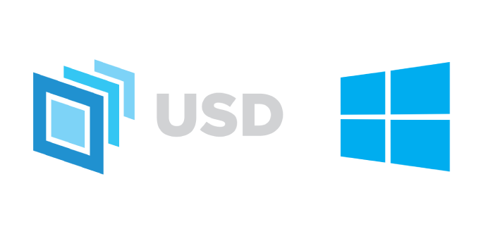

<h1 align="center">
   
  
</h1>

<h4 align="center">Windows Explorer integration for  <a href="https://openusd.org/">Pixar USD</a> files - thumbnails, 3D preview, context menus, and metadata search.</h4>

  
  
  

## Features

Supported formats: `.usd` `.usda` `.usdc` `.usdz`

| Feature | Description |
|---------|-------------|
| Thumbnails | Auto-generated 3D thumbnails via `usdrecord`, cached by Windows |
| Preview pane | Live Hydra viewport with prim path bar and animation timeline |
| Context menu | View, Edit, Crate/Uncrate, Flatten, Package, Unpackage, Stitch, Validate, Fix, Layer Stack |
| Windows Search | USD metadata indexed and searchable (frame range, frame rate, format, custom layer data) |
| File type icons | Custom icons and friendly type names for each USD format |

See [Features](docs/features.md) for the full description of each command.

Demo scenes: [KitchenSet and UsdSkel](https://openusd.org/release/dl_downloads.html#assets) (Pixar, Apache 2.0), [ALab](https://animallogic.com/technology/alab/) (Animal Logic, CC BY 4.0).

## Documentation

| Guide | Who it's for |
|-------|-------------|
| [Features](docs/features.md) | Full description of every feature and context menu command |
| [Quick Start](docs/quickstart.md) | First install, step by step |
| [Technical Guide](docs/technical.md) | Developers and contributors |
| [Runbook](docs/runbook.md) | IT / deployment / configuration |
| [Debug & FAQ](docs/debug.md) | Troubleshooting and known issues |

## Inspiration & Credit

This project is a complete rewrite, heavily inspired by [Activision/USDShellExtension](https://github.com/Activision/USDShellExtension).

The original Activision project laid the foundation for integrating USD into Windows Explorer. This version rethinks the architecture from the ground up: updated build toolchain (VS 2026, NVIDIA USD 25.08, Python 3.12), a process isolation model that keeps Python out of the Explorer process, modern Windows 11 context menu support via `IExplorerCommand`, and a streamlined install workflow.

The two main architectural differences from the Activision repo: the Activision version required two separate USD builds compiled from source (a bare-bones monolithic build with no Python for the Explorer DLL, and a full build for the Python tools), whereas this version uses a single NVIDIA pre-built SDK for everything. The Activision version enforced the "no Python in Explorer" rule by excluding Python from the SDK used by the DLL; this version enforces the same rule structurally, by routing all Python work through isolated COM Local Server executables. See the [Technical Guide](docs/TECHNICAL.md) for a full comparison.

## Contributing

Contributions are welcome. Please read [CONTRIBUTING.md](CONTRIBUTING.md) before opening a pull request; it covers the workspace setup, branch and commit conventions, pull request process, and coding style.

By participating in this project, you agree to abide by the [Code of Conduct](CONTRIBUTING.md#code-of-conduct).

## License

MIT - Copyright (C) 2025 Loops Creative Studio. See [LICENSE](LICENSE).

Third-party component notices, including logo attributions, are in [NOTICE.txt](NOTICE.txt).
