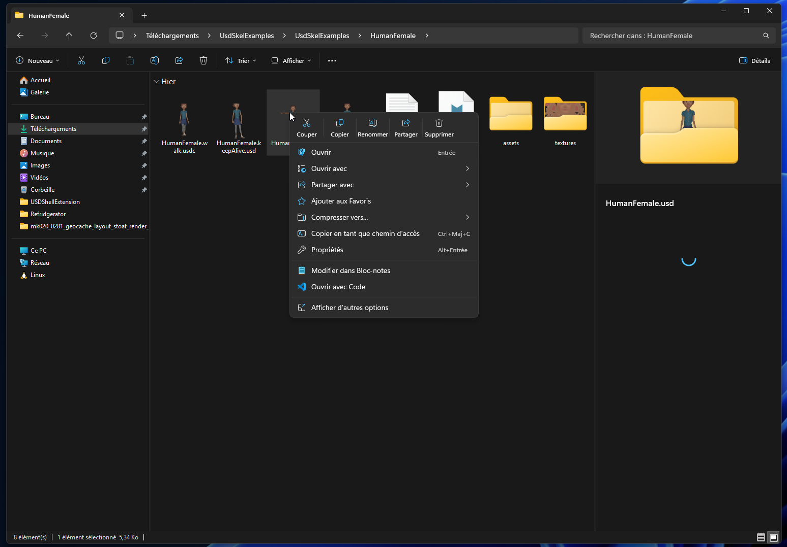
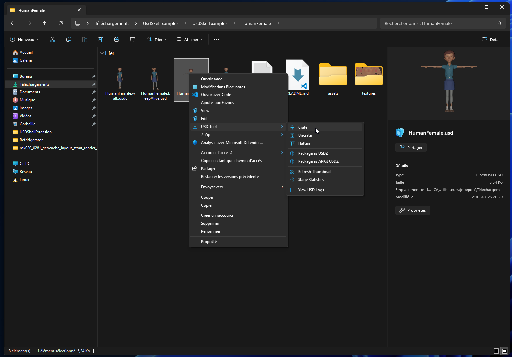
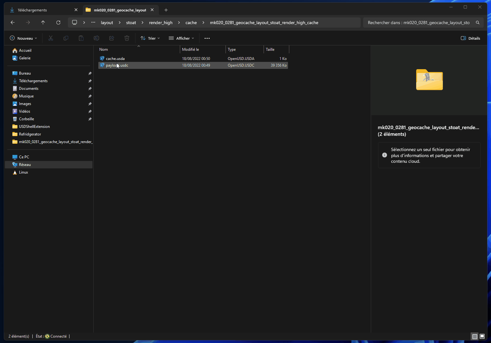
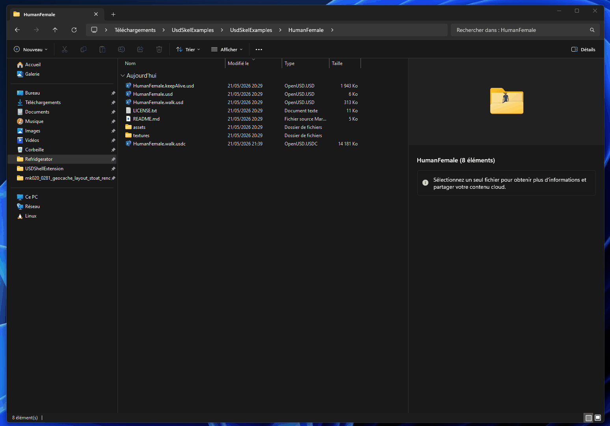

<h1 align="center">
   
  
</h1>

<h4 align="center">Windows Explorer integration for  <a href="https://openusd.org/">Pixar USD</a> files - thumbnails, 3D preview, context menus, and metadata search.</h4>

  
  
  

## Features

| Feature | Description |
|---------|-------------|
| Thumbnails | Auto-generated 3D thumbnails in Explorer |
| Preview pane | Live Hydra viewport in the Explorer preview pane |
| Context menus | Open, Edit, Compress/Uncrate, Package, Flatten |
| Windows Search | USD metadata indexed and searchable |

Supported formats: `.usd` `.usda` `.usdc` `.usdz`

## Overview

### Open & Tools

### Open in usdview

### Crate / Uncrate

### Thumbnail

Demo scenes: [KitchenSet and UsdSkel](https://openusd.org/release/dl_downloads.html#assets) (Pixar, Apache 2.0), [ALab](https://animallogic.com/technology/alab/) (Animal Logic, CC BY 4.0).

## Documentation

| Guide | Who it's for |
|-------|-------------|
| [Quick Start](docs/QUICKSTART.md) | First install, step by step |
| [Technical Guide](docs/TECHNICAL.md) | Developers and contributors |
| [Runbook](docs/RUNBOOK.md) | IT / deployment / configuration |
| [Debug & FAQ](docs/DEBUG.md) | Troubleshooting and known issues |

## Inspiration & Credit

This project is a complete rewrite, heavily inspired by [Activision/USDShellExtension](https://github.com/Activision/USDShellExtension).

The original Activision project laid the foundation for integrating USD into Windows Explorer. This version rethinks the architecture from the ground up: updated build toolchain (VS 2026, NVIDIA USD 25.08, Python 3.12), a process isolation model that keeps Python out of the Explorer process, modern Windows 11 context menu support via `IExplorerCommand`, and a streamlined install workflow.

## Contributing

Contributions are welcome. Please read [CONTRIBUTING.md](CONTRIBUTING.md) before opening a pull request; it covers the workspace setup, branch and commit conventions, pull request process, and coding style.

By participating in this project, you agree to abide by the [Code of Conduct](CONTRIBUTING.md#code-of-conduct).

## License

MIT - Copyright (C) 2025 Loops Creative Studio. See [LICENSE](LICENSE).

Third-party component notices, including logo attributions, are in [NOTICE.txt](NOTICE.txt).
