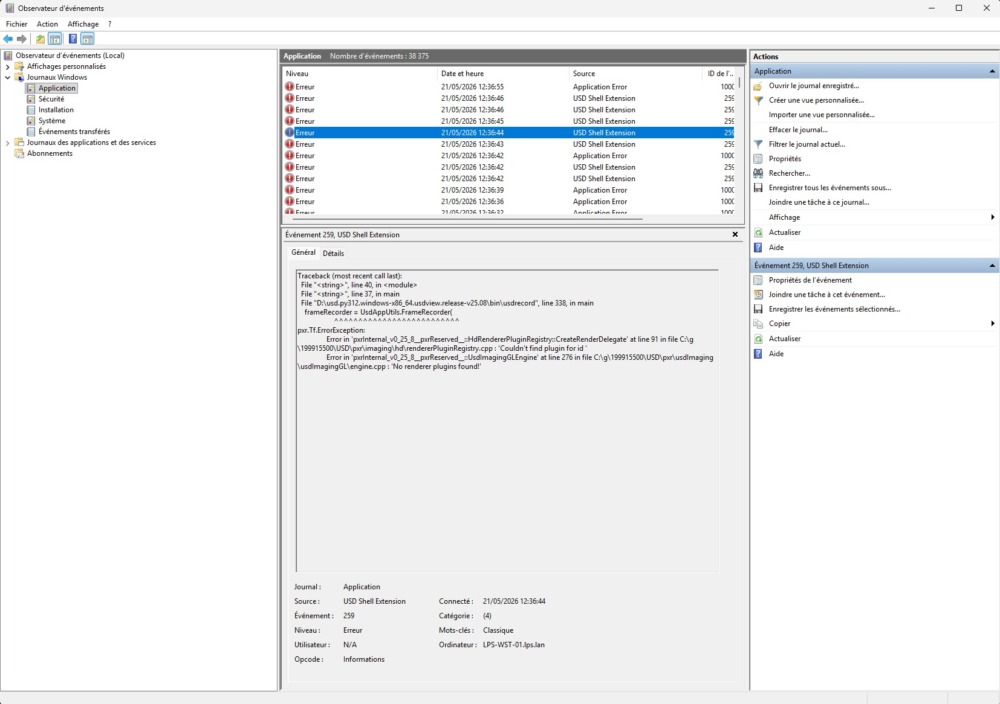
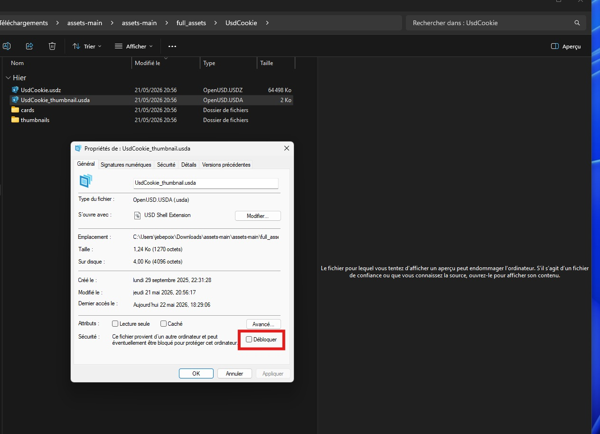

# Debug, FAQ & Known Issues

## First stop: Event Viewer

Almost every failure is logged here:

**Windows Event Viewer → Windows Logs → Application**  
Source: `USD Shell Extension`

Look for Error-level entries. The message will include a Python traceback or a Win32 error code.



---

## Symptoms and fixes

### Context menu verbs don't appear (no Open / Edit / etc.)

**Check 1: file association**  
The `.usd` / `.usda` / `.usdc` / `.usdz` extension must have USD Shell Extension as its default handler. Go to:

> Settings → Apps → Default apps → Choose defaults by file type

Set each extension to **USD Shell Extension**.

**Check 2: registration failed**  
Re-run as Administrator:
```powershell
.\install.ps1
```
Check Event Viewer for registration errors.

**Check 3: old Activision installation still registered**  
Run the legacy cleanup script:
```
\\lps-srv-01\it\loops-it\toolbox\sandbox\windows\Remove-UsdShellExtension-Legacy.ps1
```
Then re-run `.\install.ps1`.

---

### Right-click still shows "Activision USD Shell Extension"

Windows caches the executable description in the MuiCache registry key.

`install.ps1` clears this automatically. If it persists:

1. Open `regedit.exe`
2. Navigate to:
   `HKEY_CURRENT_USER\SOFTWARE\Classes\Local Settings\Software\Microsoft\Windows\Shell\MuiCache`
3. Delete all values that contain `Activision` or `UsdShellExtension`
4. Restart Explorer or log out/in

---

### 3D Preview pane is black

**Cause**: usdview's Hydra Storm renderer requires OpenGL 4.5. If the GPU or driver doesn't support it, Storm silently fails.

**Workaround, wireframe only**: Storm's wireframe mode works without GLSL (this is expected behaviour, not a bug).

**Fix, switch renderer**: Install Embree or another CPU-based Hydra renderer and set:
```ini
[RENDERER]
PREVIEW=Embree
```

**If usdview works from PowerShell but not from Explorer**: Check `PYTHONHOME` is not set as a system environment variable pointing to a different Python. The bundled Python in `python\` must take precedence.

---

### Preview pane shows "This file may damage your computer"

**Full message (Windows):** *"Le fichier pour lequel vous tentez d'afficher un aperçu peut endommager l'ordinateur."* / *"The file you are trying to preview may damage your computer."*

**Cause**: the file was downloaded from the internet. Windows attaches a hidden security marker (`Zone.Identifier`) to downloaded files. When you open the preview pane on such a file, Windows blocks the preview handler and shows this warning instead.

**Fix 1 - via Properties (per file):**

1. Right-click the USD file in Explorer.
2. Select **Properties**.
3. At the bottom of the **General** tab, check the **Unblock** checkbox.
4. Click **OK**. The preview pane will work on the next selection.



**Fix 2 - via PowerShell (entire folder at once):**

```powershell
Get-ChildItem "C:\path\to\your\usd\folder" -Recurse -Include "*.usd","*.usda","*.usdc","*.usdz" | Unblock-File
```

---

### usdview opens but viewport is black (when launched via Open)

This was a bug in earlier builds where usdview ran inside the COM server's embedded Python interpreter, which prevented Qt from initialising the WGL OpenGL context.

**Fixed in current build**: `View()` now uses `CreateProcess` to launch usdview as a subprocess, giving it a proper Qt/OpenGL context identical to launching from PowerShell.

If you still see this after updating, verify the build is current:
```powershell
.\build.ps1
.\install.ps1  # as Administrator
```

---

### Thumbnails not generating

1. Check Event Viewer; `UsdThumbnail.py` errors appear there with the full Python traceback.
2. Verify `[USD] PATH` in `UsdShellExtension.ini` contains the SDK `bin\`, `lib\`, and `scripts\` folders.
3. Clear the Windows thumbnail cache:
   - Run `cleanmgr.exe` → check "Thumbnails"
   - Or delete `%LOCALAPPDATA%\Microsoft\Windows\Explorer\thumbcache_*.db`
4. Right-click a USD file → **Refresh Thumbnail** to force regeneration.

---

### Thumbnails render flat or without materials

The thumbnail subprocess (`UsdThumbnail.py`) derives the USD SDK `plugin\usd\` path from `PYTHONPATH` and sets `PXR_PLUGINPATH_NAME` to that path before importing pxr. If the path cannot be resolved (SDK not in `[USD] PYTHONPATH`), HdStorm and MaterialX plugins are not discovered and the render falls back to unlit geometry.

Check that `[USD] PYTHONPATH` in `UsdShellExtension.ini` points to the SDK's `lib\python` folder, and that `plugin\usd\` exists at the same SDK root.

---

### Hydra Renderer context menu is greyed out in the preview pane

Right-clicking in the preview pane shows the **Hydra Renderer** submenu but it is disabled.

**Fixed in current build**: the context menu was previously built once at startup before the first OpenGL frame was rendered. `GetRendererPlugins()` returned an empty list because the Hydra engine was not yet initialized. The menu is now rebuilt on every right-click, so it always reflects the live renderer state.

If you still see this after updating, verify the build is current and reinstall:

```powershell
.\build.ps1
.\install.ps1  # as Administrator
```

---

### install.ps1 fails: DLL is locked

The install script automatically stops COM servers and restarts Explorer before copying files. If it still fails:

1. Open Task Manager and end `UsdPythonToolsLocalServer.exe`, `UsdPreviewLocalServer.exe`, `UsdSdkToolsLocalServer.exe`, and `dllhost.exe`.
2. Re-run `.\install.ps1`.

---

### "Python 3.12 is not installed" error during registration

The installer checks for the bundled Python at `%ProgramFiles%\UsdShellExtension\python\python312.dll`.

This means `install.ps1` didn't copy the Python folder from the SDK, or the SDK path was wrong.

Check that `D:\usd.py312.windows-x86_64.usdview.release-v25.08\python\` exists before running `install.ps1`.

---

### Build error: `pyconfig.h: No such file or directory`

Pass the SDK path explicitly to MSBuild:
```powershell
.\build.ps1
```
`build.ps1` already passes `/p:PythonHome=...` to MSBuild. If you're building directly via Visual Studio, set the `PythonHome` property or the `PythonHome` environment variable to the SDK's `python\` subfolder.

---

### Build error: `atlbase.h` not found / ATL missing

Visual Studio 2026 does not install ATL by default.

Open **Visual Studio Installer → Modify** and add:
> C++ ATL for latest v145 build tools (x86 & x64)

---

## Known issues

| Issue | Status |
|-------|--------|
| usdview takes 10–30 s to open on first launch | Expected; Python startup + USD plugin discovery. Subsequent opens are faster. |
| Preview pane black on integrated Intel GPU | Storm requires OpenGL 4.5. Set `PREVIEW=` renderer to a software renderer or leave preview unused. |
| Thumbnails generate at low resolution for large USDZ scenes | usdrecord timeout. No fix yet; complex scenes may not thumbnail. |
| Windows Search indexing can be slow for large USD files | IPropertyStore reads the file synchronously; very large layers cause a delay in the indexer. |
| `.usd` files associated with another app ignore shell verbs | User-level association overrides system registration. Reset via Default Apps settings. |
| Preview pane shows "this file may damage your computer" for downloaded files | Windows `Zone.Identifier` security marker blocks the preview handler. Right-click the file → Properties → check **Unblock**, or use `Unblock-File` in PowerShell. |

---

## Collecting a diagnostic bundle

If you need to report a bug, include:

1. Event Viewer export: right-click **Application** log → **Save All Events As...** → `.evtx` or `.csv`
2. Output of `.\build.ps1` and `.\install.ps1`
3. Contents of `C:\Program Files\UsdShellExtension\UsdShellExtension.ini`
4. Output of:
   ```powershell
   Get-ChildItem "C:\Program Files\UsdShellExtension\" | Select-Object Name, Length, LastWriteTime
   ```
